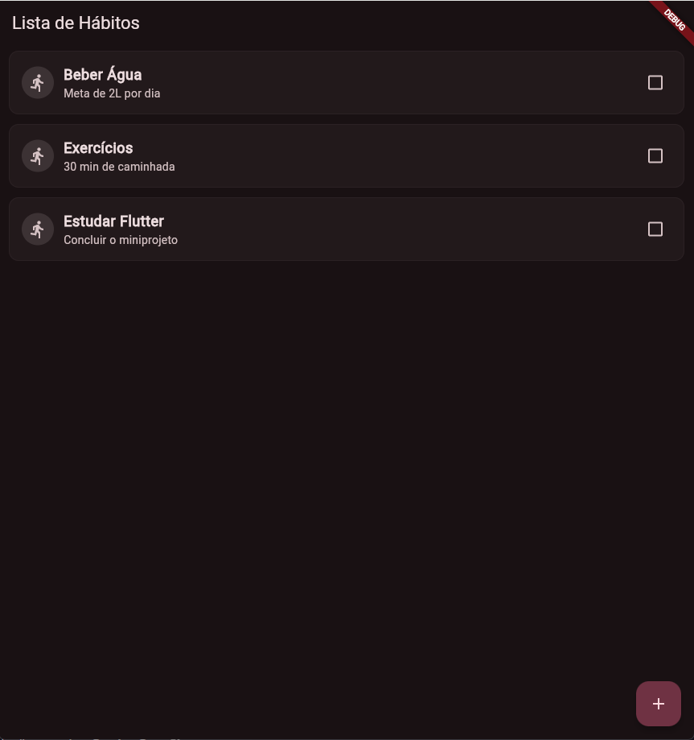
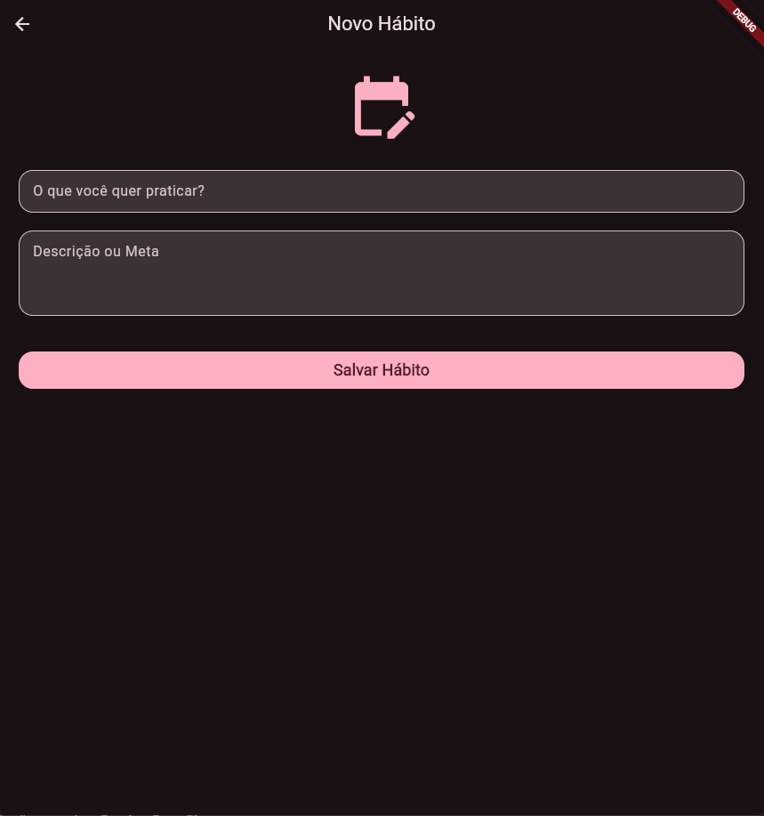
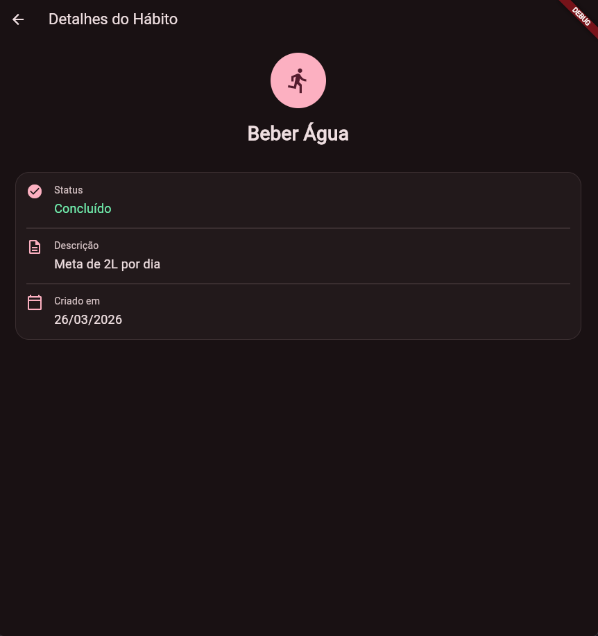

# 📝 HabitTracker - Controle de Hábitos Pessoais

Este aplicativo foi desenvolvido como parte de uma atividade prática de Flutter para consolidar conceitos de interface, navegação e gerenciamento de estado.

---

## 👤 Identificação
* **Nome do Aluno:** Iago Rech Tramontin
* **Disciplina:** Desenvolvimento de Dispositivos Móveis
* **Data:** Março de 2026

---

## 📖 Descrição do Aplicativo
O **HabitTracker** é um mini aplicativo funcional projetado para ajudar usuários a monitorar suas rotinas diárias. O foco do projeto foi a criação de uma experiência fluida, utilizando componentes modernos do **Material 3** e simulando o comportamento real de uma aplicação que consome dados de uma API ou banco de dados.

---

## ✨ Funcionalidades Implementadas

O projeto cumpre todos os requisitos técnicos solicitados:

* **Listagem Dinâmica:** Exibe hábitos de forma organizada utilizando `ListView.builder`.
* **Carregamento Assíncrono:** Simula a busca de dados iniciais com um delay de 2 segundos utilizando `async/await` e `Future.delayed`.
* **Gerenciamento de Estado:** Permite marcar/desmarcar hábitos como concluídos via `Checkbox`, atualizando a interface instantaneamente com `setState`.
* **Feedback Visual:** Hábitos concluídos recebem estilo diferenciado com texto riscado (`lineThrough`) e redução de opacidade.
* **Fluxo de Cadastro:** Possui uma tela de formulário para adicionar novos hábitos à lista.
* **Detalhamento de Itens:** Exibe informações detalhadas (nome, descrição, data de criação e status) em uma tela separada.
* **Navegação Estruturada:** Utiliza rotas nomeadas e `Navigator.pushNamed` para transição entre telas e passagem de parâmetros.

---

## 📸 Screenshots

| Lista de Hábitos (Home) | Cadastro de Hábito | Detalhes do Hábito |
| :---: | :---: | :---: |
|  |  |  |

---

## 🛠️ Instruções para Execução

Para rodar o projeto em sua máquina local, siga estes passos:

1.  **Clone o repositório ou extraia o arquivo .zip.**
2.  **Certifique-se de ter o Flutter instalado:**
    ```bash
    flutter --version
    ```
3.  **Instale as dependências do projeto:**
    No diretório raiz, execute:
    ```bash
    flutter pub get
    ```
4.  **Execute o aplicativo:**
    Com um emulador aberto ou dispositivo conectado, utilize:
    ```bash
    flutter run
    ```

---

## 📁 Estrutura do Projeto
A organização dos arquivos segue o padrão recomendado:
* `lib/models/`: Definição da classe `Habito`.
* `lib/screens/`: Telas da aplicação (Home, Cadastro, Detalhes).
* `lib/routes/`: Gerenciamento das rotas nomeadas.
* `lib/main.dart`: Ponto de entrada e configuração do tema (Dark Mode).