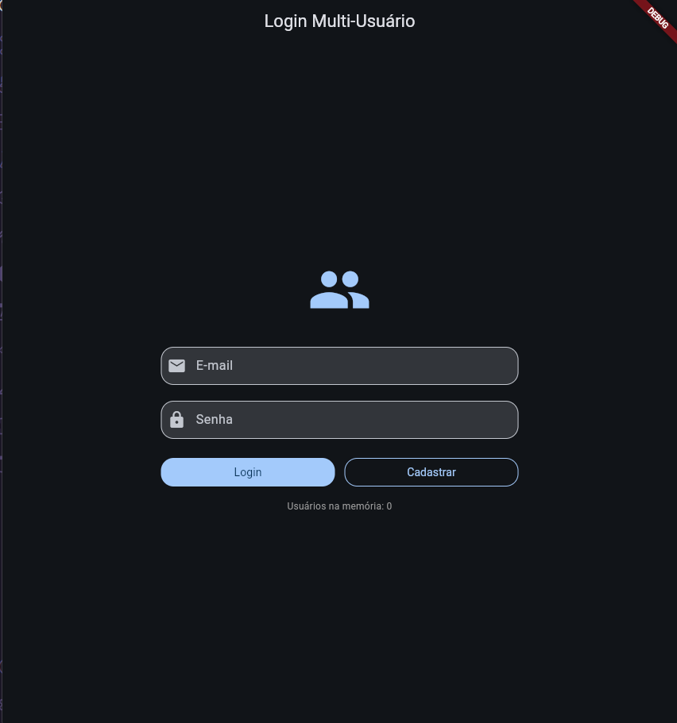
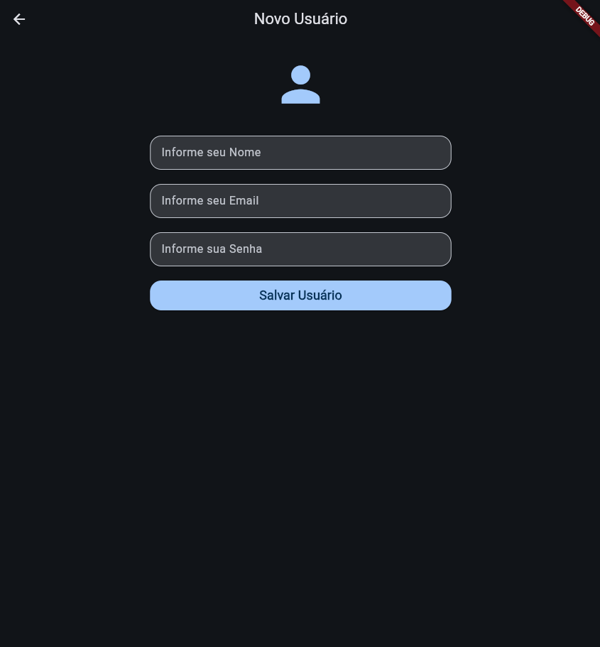
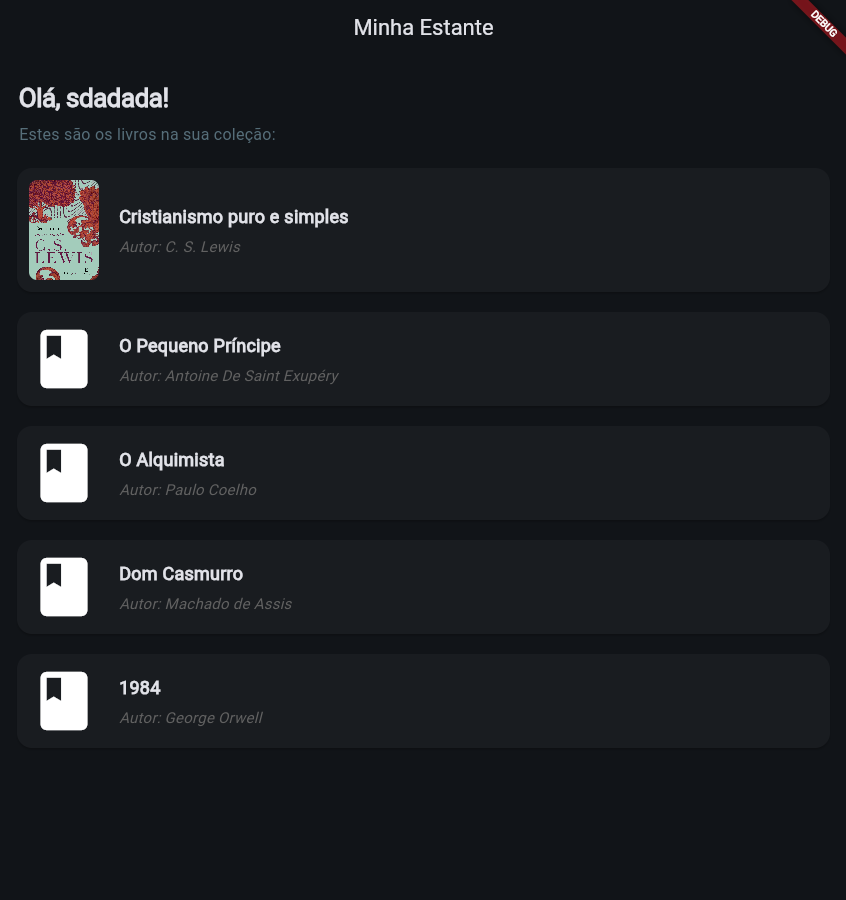

# 📚 Minha Estante - App de Gerenciamento de Livros

Este é um aplicativo mobile desenvolvido em **Flutter** para o gerenciamento de uma biblioteca pessoal. O foco do projeto é oferecer uma experiência fluida de cadastro e visualização de livros, aplicando conceitos fundamentais de desenvolvimento mobile e navegação.

## 🎯 Objetivo
O projeto foi criado para demonstrar a integração entre telas, o gerenciamento de estado efêmero e a manipulação de dados entre rotas, simulando um fluxo real de autenticação e listagem de itens.

## 🚀 Funcionalidades Implementadas
* **Cadastro de Usuários:** Permite criar novos perfis com nome, e-mail e senha.
* **Autenticação de Login:** Validação de campos obrigatórios e verificação de credenciais em uma lista de usuários na memória.
* **Mensagem de Boas-Vindas Personalizada:** A Home identifica o usuário logado e exibe seu nome dinamicamente.
* **Listagem de Livros:** Exibição de capas, títulos e autores consumindo um array de objetos.
* **Simulação de Carregamento:** Uso de indicadores de progresso (Loading) para simular chamadas de API/Banco de Dados.

## 📱 Descrição das Telas

### 1. Tela de Login
A porta de entrada do app. Valida se os campos de e-mail e senha foram preenchidos e busca o usuário correspondente na lista de cadastrados. Utiliza `Navigator.pushNamedAndRemoveUntil` para garantir que o usuário não retorne ao login após entrar no app.

### 2. Tela de Cadastro
Destinada à criação de novos usuários. Utiliza a classe `User` como modelo de dados. Após o cadastro bem-sucedido, os dados são enviados de volta para a tela de login via `Navigator.pop`.

### 3. Tela Home
Exibe a estante de livros do usuário. Possui um cabeçalho fixo com saudação personalizada e uma lista rolável (`ListView`) que renderiza os cards dos livros com imagens carregadas via rede.

## 🧠 Conceitos Utilizados

* **Flutter & Dart:** Base do desenvolvimento multiplataforma.
* **Widgets de UI:** Uso intensivo de `Material Design` (`Scaffold`, `Card`, `TextField`, `ElevatedButton`, etc.).
* **Gerenciamento de Estado:** Uso de `setState` para atualizar a interface em tempo real (como preenchimento de campos e estados de loading).
* **Navegação e Rotas:** Implementação de rotas nomeadas (`Named Routes`) e passagem de argumentos entre telas via `Navigator`.
* **Programação Assíncrona:** Uso de `Future.delayed` e `async/await` para simular o comportamento de sistemas reais.
* **POO (Programação Orientada a Objetos):** Criação e manipulação de classes modelos como `User` e `Livro`.

## 🛠️ Instruções para Execução

Para rodar o projeto localmente, siga os passos abaixo:

1.  **Instale o Flutter:** Certifique-se de ter o SDK do Flutter configurado em sua máquina.
2.  **Clone o Repositório:**
    ```bash
    git clone [https://github.com/seu-usuario/minha-estante.git](https://github.com/seu-usuario/minha-estante.git)
    ```
3.  **Instale as Dependências:**
    ```bash
    flutter pub get
    ```
4.  **Execute o App:**
    ```bash
    flutter run
    ```

## 📸 Prints do Aplicativo

| Login | Cadastro | Home (Estante) |
| :---: | :---: | :---: |
|  |  |  |

---
*Desenvolvido por Iago Rech Tramontin*