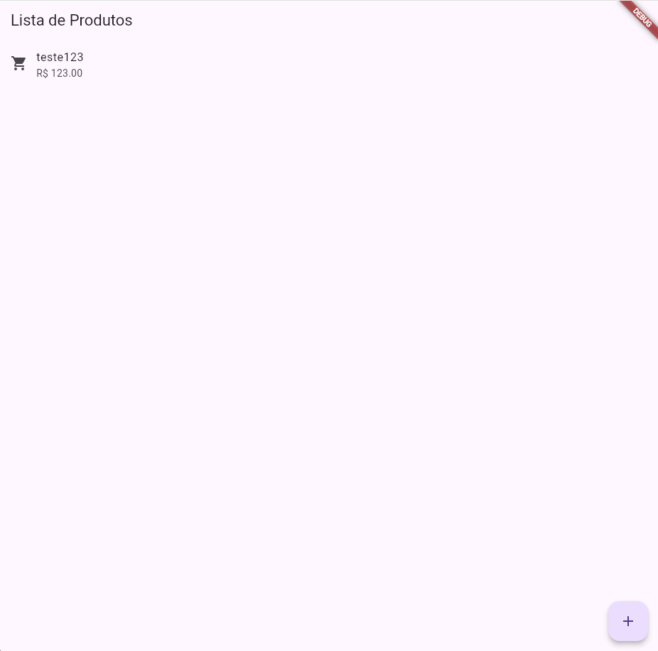
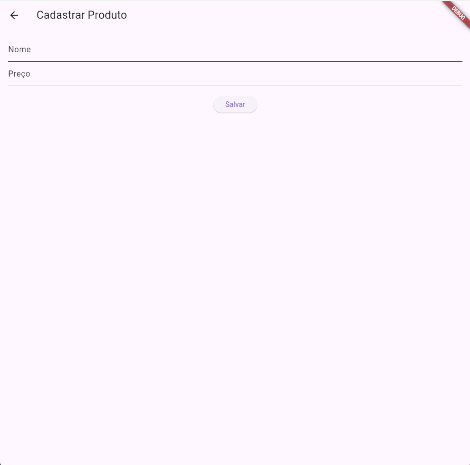
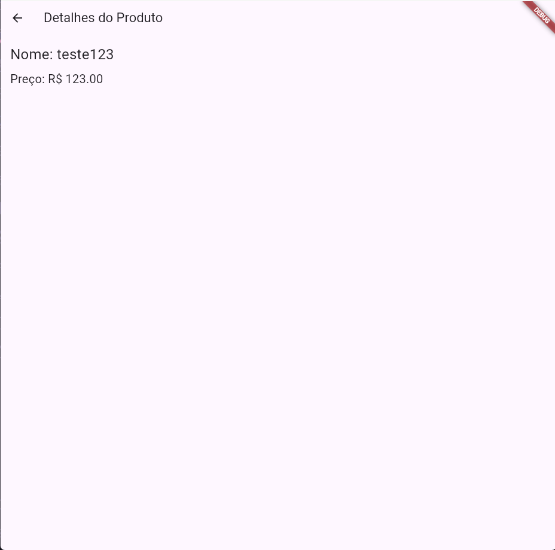

````markdown
# App de Cadastro de Produtos 🛒

Este é um aplicativo Flutter desenvolvido como atividade prática para demonstrar a navegação entre múltiplas telas, uso da pilha de navegação (`push` e `pop`) e passagem de dados entre telas.

## 👤 Informações do Aluno
- **Nome:** Iago Rech Tramontin
- **Turma:** Ads 5 fase

---

## 📸 Screenshots

| Tela 1 - Lista de Produtos | Tela 2 - Cadastro | Tela 3 - Detalhes |
| :---: | :---: | :---: |
|  |  |  |

---

## 🔄 Fluxo de Navegação

O aplicativo possui 3 telas principais com o seguinte fluxo de comunicação:

1. **Tela 1 (Lista de Produtos) para Tela 2 (Cadastro):**
   - A navegação ocorre ao clicar no botão Flutuante (FAB `+`) utilizando `Navigator.push`.
   - É utilizado o `await` para que a Tela 1 aguarde o retorno da Tela 2.
   - Na Tela 2, após preencher e validar os dados, o usuário clica em "Salvar", que executa um `Navigator.pop(context, produto)`, retornando o objeto criado para a Tela 1, que então atualiza o estado (`setState`) e exibe o novo item na lista.

2. **Tela 1 (Lista de Produtos) para Tela 3 (Detalhes):**
   - A navegação ocorre ao tocar em um item específico da lista (`onTap` no `ListTile`).
   - O objeto `Produto` selecionado é passado diretamente como parâmetro para o construtor da `DetalheProduto` via `Navigator.push` com `MaterialPageRoute`.
   - A Tela 3 recebe os dados e os exibe. O usuário pode voltar para a lista usando a seta padrão de voltar na `AppBar`.

---

## 🚀 Como Executar o Projeto

Siga os passos abaixo para testar o aplicativo em sua máquina:

1. **Pré-requisitos:** Certifique-se de ter o Flutter instalado e configurado corretamente no seu ambiente, além de um emulador (Android/iOS) ou um dispositivo físico conectado.

2. **Clone ou baixe o repositório:**
   ```bash
   git clone [https://github.com/I4g0m1t0/Dev_Mobile.git]
````

3. **Abra o terminal na pasta do projeto e instale as dependências:**

   ```bash
   flutter pub get
   ```

4. **Execute o aplicativo:**

   ```bash
   flutter run
   ```
---