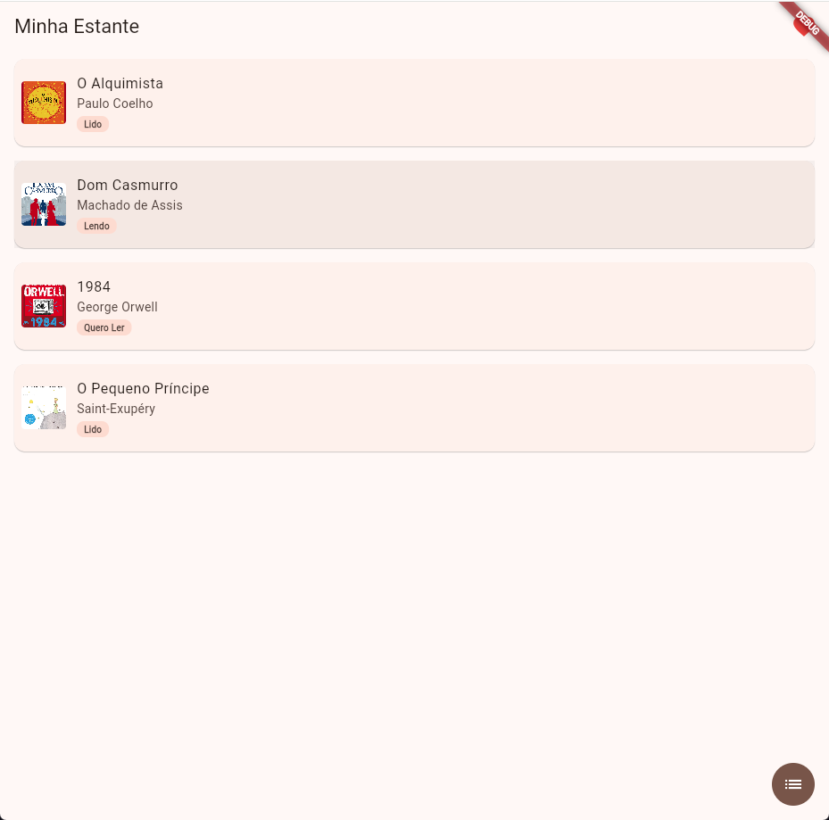
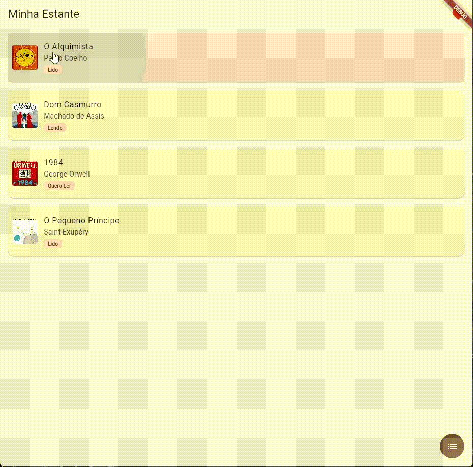

# Galeria de Animações - Estante de Livros 📚

Aplicativo desenvolvido em Flutter para a Atividade Prática (Aula 9) da 5ª Fase de Análise e Desenvolvimento de Sistemas (Faculdade Senac Joinville). O projeto demonstra o uso prático de diferentes tipos de animações e componentes do Material Design 3.

## 📱 Demonstração

*(Substitua os caminhos abaixo pelas imagens ou GIFs reais do seu projeto. Dica: crie uma pasta `screenshots` no seu repositório para organizar as imagens).*

| Tela Inicial | Animação Hero |
| :---: | :---: |
|  |  |

## 🚀 Requisitos Implementados

**1. Animação Implícita**
- Utilizado um `AnimatedContainer` no `FloatingActionButton` da tela inicial.
- **Comportamento:** Ao ser clicado, ele alterna entre o formato de círculo (ícone de lista) e um formato retangular arredondado (ícone de grid), mudando também a sua cor de fundo. A transição ocorre com duração de 300ms e curva `Curves.easeIn`.

**2. Animação Explícita**
- Implementada com `AnimationController`, `Tween<double>` e `CurvedAnimation`.
- **Comportamento:** Um ícone de coração no `AppBar` da tela inicial pulsa (aumenta e diminui a escala) infinitamente. Foi utilizado o `AnimatedBuilder` para garantir a performance, reconstruindo apenas o ícone, e o método `dispose()` foi devidamente chamado no encerramento do widget.

**3. Hero Animation**
- **Comportamento:** Transição suave da capa do livro entre a `LivrosScreen` (origem) e a `DetalheLivroScreen` (destino).
- A tag única foi gerada dinamicamente utilizando o título do livro (`tag: 'capa_${livro.titulo}'`), evitando conflitos na renderização da lista.

**4. Material Design 3**
- Habilitado através do `useMaterial3: true` no `ThemeData`.
- Paleta de cores gerada automaticamente com `ColorScheme.fromSeed(seedColor: Colors.brown)`.
- Uso do componente M3 `FilledButton.icon` na tela de detalhes do livro.

**5. Widget Customizado Reutilizável**
- Criação do componente `StatusBadge`.
- **Comportamento:** Recebe o texto via parâmetro e é instanciado usando `const`. Foi reutilizado em dois locais: na listagem (abaixo do nome do autor) e na tela de detalhes.

## 🛠️ Como executar

1. Clone o repositório.
2. Certifique-se de ter o Flutter instalado e atualizado.
3. Execute `flutter pub get` para baixar as dependências.
4. Execute o app com `flutter run` (recomenda-se testar em um dispositivo físico para melhor visualização da performance das animações).