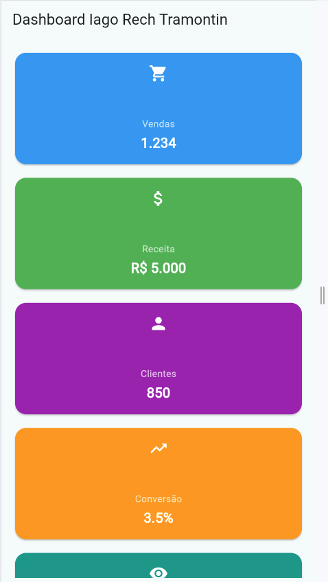
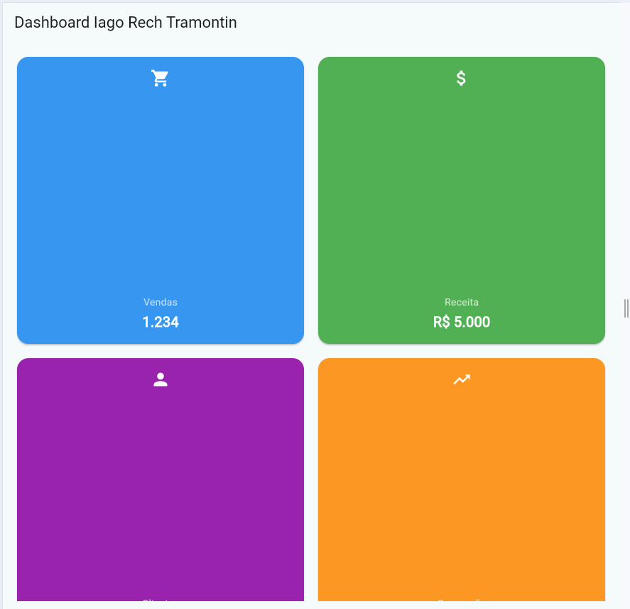
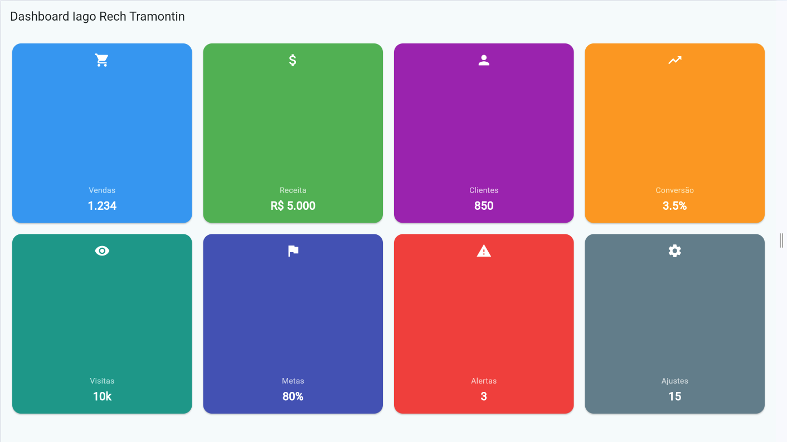

# Dashboard Responsivo - Flutter

Este projeto demonstra a implementação de uma interface adaptável (Responsive Design) utilizando o framework Flutter, capaz de reestruturar os seus componentes visualmente para ecrãs de telemóvel, tablet e computador.

## 👤 Identificação
* **Nome:** [TEU NOME AQUI]
* **Turma:** [TUA TURMA AQUI]

---

## 📸 Screenshots dos Layouts

| 📱 Mobile | 📑 Tablet | 💻 Desktop |
| :---: | :---: | :---: |
|  |  |  |

> **Nota:** As capturas de ecrã acima demonstram a transição entre o menu lateral oculto (Drawer) no telemóvel e a interface expandida em colunas no desktop.

---

## 🚀 Como Executar o Projeto

Siga os passos abaixo para configurar e rodar a aplicação na sua máquina local:

### 1. Pré-requisitos
* Ter o [Flutter SDK](https://docs.flutter.dev/get-started/install) instalado na versão estável.
* Ter um navegador (Chrome/Edge) ou emulador configurado.

### 2. Obter as dependências
No terminal, dentro da pasta raiz do projeto (`dashboard_responsivo`), execute:
```bash
flutter pub get

### 3. Executar a Aplicação
Podes executar o projeto utilizando um dos seguintes comandos, dependendo do ambiente que desejas testar:

* **No Navegador (Recomendado para testar a responsividade):**
  ```bash
  flutter run -d chrome