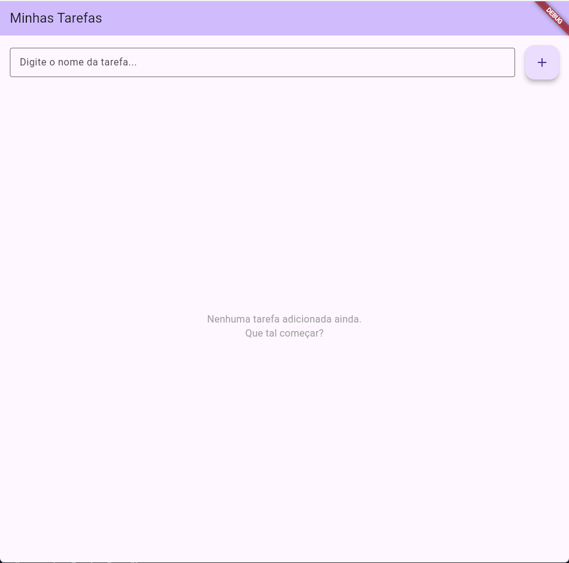
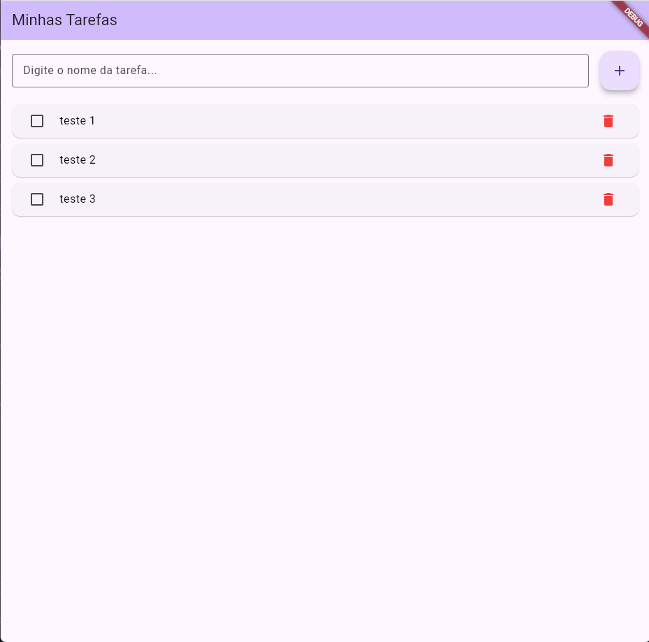
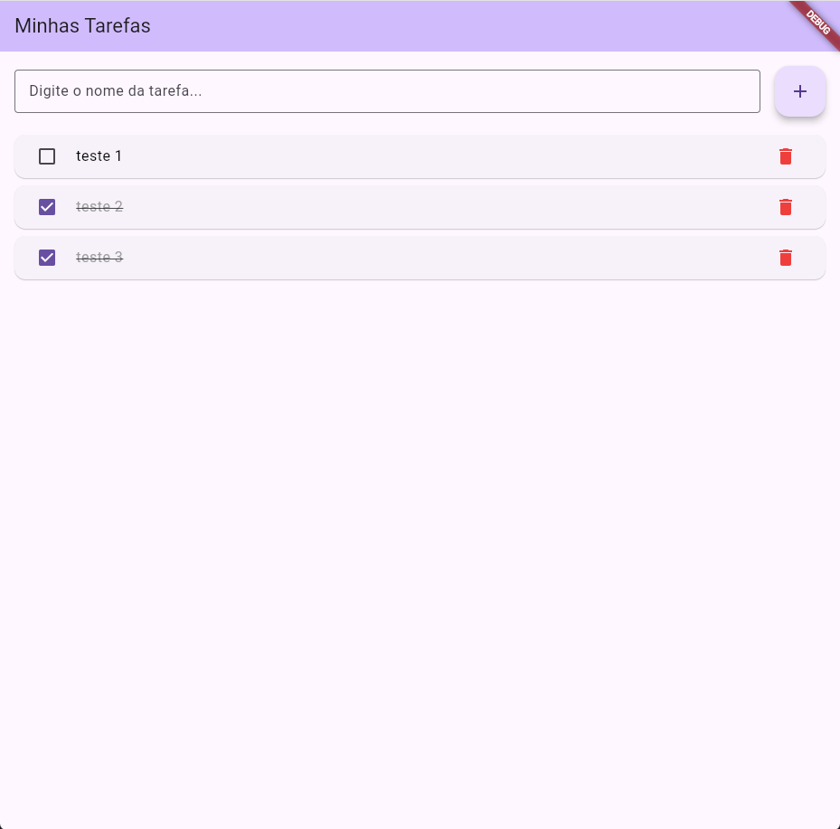

# ✅ App Lista de Tarefas (To-Do List) em Flutter

**Nome:** [Iago Rech Tramontin]  
**Turma:** [Ads 5 Fase]  

Um aplicativo simples e direto para gerenciamento de tarefas (To-Do List), desenvolvido em Flutter. Este projeto utiliza o gerenciamento de estado nativo (`StatefulWidget` e `setState()`) para criar uma interface reativa e dinâmica.

---

## 📱 Screenshots

Aqui estão algumas telas do aplicativo em funcionamento:

| Lista Vazia | Com Tarefas | Tarefas Concluídas |
| :---: | :---: | :---: |
|  |  |  |

*(Nota: Para adicionar as imagens, salve os prints na pasta raiz do seu projeto ou em uma pasta `/assets/images` e atualize os links acima).*

---

## ⚙️ Funcionalidades Implementadas

O projeto atende a todos os requisitos solicitados:

* **Adicionar Tarefas:** Entrada de texto via `TextField` com um botão flutuante (`FloatingActionButton`) para inserir novas atividades na lista. O campo é limpo automaticamente após a adição.
* **Exibir Lista de Tarefas:** Utilização de um `ListView.builder` para renderização eficiente. Quando não há itens, uma mensagem amigável é exibida ("Nenhuma tarefa adicionada ainda").
* **Marcar como Concluída:** Cada item possui um `Checkbox`. Ao marcá-lo, o texto recebe uma linha riscada (`TextDecoration.lineThrough`) e fica acinzentado, indicando conclusão.
* **Remover Tarefas:** Botão de exclusão (ícone de lixeira vermelha) ao lado de cada tarefa para retirá-la da lista instantaneamente.
* **Gerenciamento de Estado:** Aplicação de `setState()` para atualizar a tela sempre que o usuário interage com as tarefas (adicionando, concluindo ou deletando).

---

## 🚀 Como Executar o Projeto

Siga os passos abaixo para rodar o aplicativo na sua máquina:

### Pré-requisitos
* [Flutter SDK](https://docs.flutter.dev/get-started/install) instalado.
* Um emulador (Android/iOS) configurado ou um dispositivo físico conectado.

### Passos

1. Clone este repositório ou baixe o código-fonte:
   ```bash
   git clone [link-do-seu-repositorio]
    ```

2. Acesse a pasta do projeto:
    ```bash
    cd [nome-da-pasta-do-projeto]
    ```

3. Instale as dependências:
    ```bash
    flutter pub get
    ```

4. Execute o aplicativo:
    ```bash
    flutter run
    ```